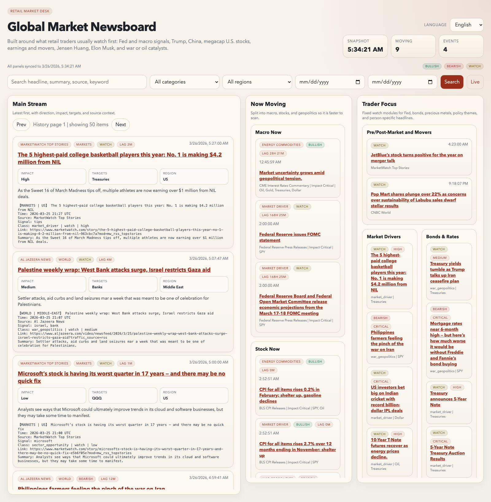
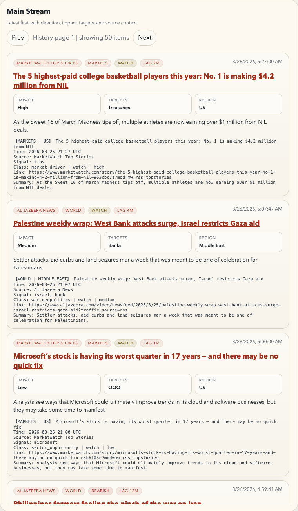
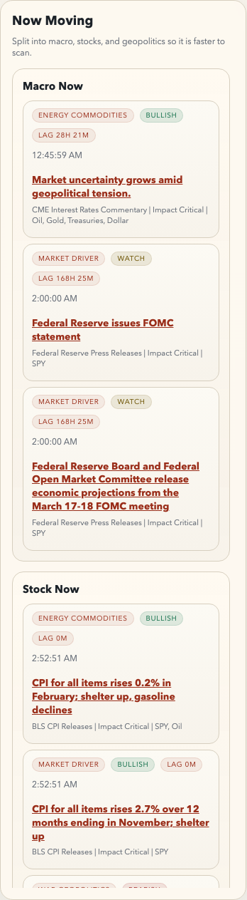
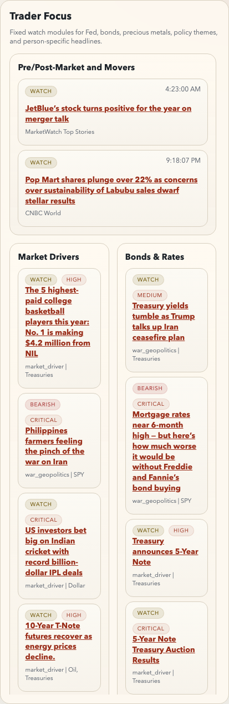
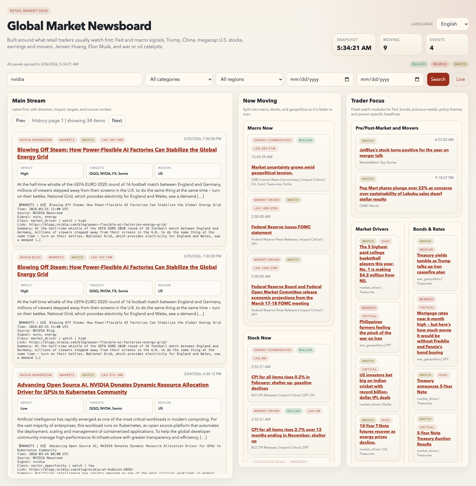
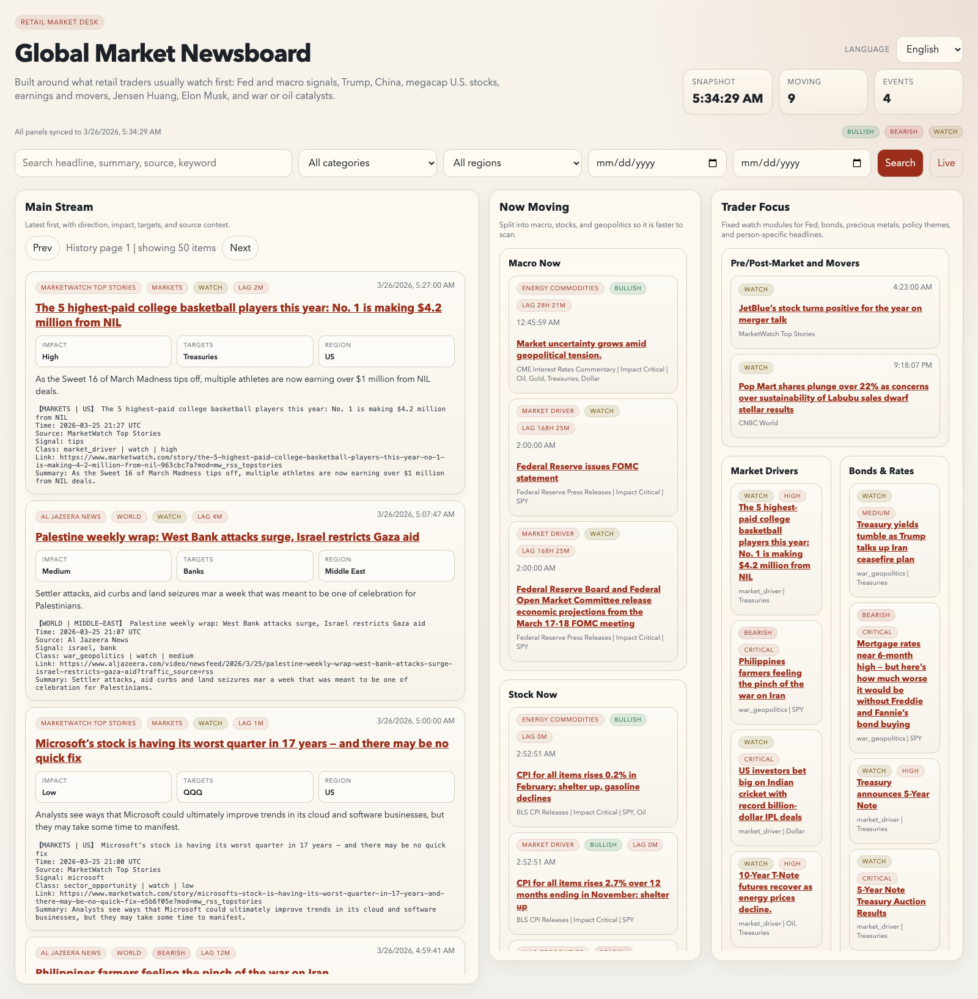
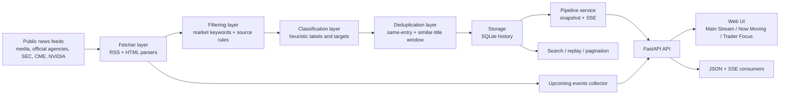

# Global Market Newsboard

[](LICENSE)


Open-source real-time market news dashboard built for retail traders who want a fast, public-source market monitor without a terminal subscription.

Global Market Newsboard tracks public market-moving headlines, official releases, filings, and event calendars, then turns them into a live trader-facing board with:

- real-time stream updates
- `Now Moving` market buckets
- `Trader Focus` modules
- search and historical replay
- multilingual UI
- lightweight heuristic classification

The project is built for people who want a Bloomberg-style market monitor using public sources and a simple deployment path.

## Screenshots

### Full Dashboard



### Key Panels

Main Stream



Now Moving



Trader Focus



Search and replay



Mid-layout detail



## Architecture



## Why This Project

- Focused on what traders scan first: Fed, macro, megacaps, China, Trump, Jensen Huang, Musk, bonds, FX, metals, oil
- Uses public feeds and official sources instead of closed terminals
- Keeps source links visible to avoid black-box aggregation
- Runs locally with SQLite, but is easy to deploy with Docker

## Current Feature Set

- Real-time SSE stream for new headlines
- Multi-source polling across media, official agencies, central banks, SEC filings, CME, NVIDIA, and more
- Lightweight cross-source deduplication
- Historical storage with local retention control
- Keyword search, pagination, and date filtering
- `Now Moving` buckets:
  - macro
  - stocks
  - geopolitics
- `Trader Focus` modules:
  - market drivers
  - bonds and rates
  - dollar and FX
  - precious metals
  - China watch
  - Trump watch
  - Jensen Huang
  - Elon Musk
  - hot stocks
  - earnings and guidance
  - policy and regulation
  - war and oil
- UI language switching:
  - Simplified Chinese
  - English
  - Traditional Chinese
  - Japanese
  - Korean
  - Spanish
  - French

## Stack

- `FastAPI`
- `Uvicorn`
- `httpx`
- `feedparser`
- `SQLite`
- plain HTML/CSS/JS frontend

## Quick Start

```bash
python3 -m venv .venv
source .venv/bin/activate
pip install -r requirements.txt
uvicorn src.market_stream.app:app --host 127.0.0.1 --port 8010 --reload
```

Open:

- `http://127.0.0.1:8010/`
- `http://127.0.0.1:8010/health`
- `http://127.0.0.1:8010/api/items`
- `http://127.0.0.1:8010/api/search?q=fed`
- `http://127.0.0.1:8010/api/dashboard`
- `http://127.0.0.1:8010/stream`

## Docker

```bash
cp .env.example .env
docker compose up --build
```

Then open:

- `http://127.0.0.1:8010/`

Persistent data is stored in the mounted `./data` directory.

## Configuration

Set these environment variables if needed:

- `MARKET_STREAM_POLL_INTERVAL_SECONDS`
- `MARKET_STREAM_MAX_ITEMS`
- `MARKET_STREAM_MAX_STORED_ITEMS`
- `MARKET_STREAM_DB_PATH`
- `MARKET_STREAM_HOST`
- `MARKET_STREAM_PORT`
- `PORT`
- `MARKET_STREAM_CLASSIFIER_MODE`
- `OLLAMA_BASE_URL`
- `MARKET_STREAM_OLLAMA_MODEL`
- `MARKET_STREAM_OLLAMA_TIMEOUT_SECONDS`

See [.env.example](.env.example).

## Deployment

### Local always-on on macOS

Files included:

- [scripts/run_local.sh](scripts/run_local.sh)
- [deploy/com.newsclassified.marketstream.plist](deploy/com.newsclassified.marketstream.plist)

### Container deployment

- [Dockerfile](Dockerfile)
- [docker-compose.yml](docker-compose.yml)
- [DEPLOY.md](DEPLOY.md)

This repo is designed so the same app can run:

- on a local machine
- on a VPS
- in Docker
- behind Nginx or a cloud reverse proxy

## Project Structure

```text
src/market_stream/
  app.py                  FastAPI app and frontend
  config.py               sources, keywords, runtime config
  fetcher.py              feed and page ingestion
  pipeline.py             polling, dedupe, stream pipeline
  storage.py              SQLite persistence
  classifier.py           heuristic classifier
  retail_dashboard.py     trader-facing sections
  events.py               upcoming event calendar
```

## Copyright, Attribution, and Usage Boundaries

This repository contains only original code and metadata produced by this project.

Important:

- News headlines, summaries, source names, logos, and linked articles remain the property of their respective publishers.
- This project is intended to aggregate and link to public sources, not to republish full copyrighted articles.
- If you deploy this publicly, you are responsible for complying with each upstream source's terms of use, robots rules, branding rules, and redistribution limits.
- Do not market this project as an official product of any upstream publisher, exchange, regulator, or company.

See [NOTICE](NOTICE) for a short attribution and content-usage notice.

## License

This codebase is released under the [Apache-2.0 License](LICENSE).

## Financial Disclaimer

This project is for information and research purposes only.

- It is not investment advice.
- It is not a broker, exchange, or regulated market data terminal.
- It does not guarantee completeness, timeliness, or accuracy.

## Contributing

Pull requests are welcome. See [CONTRIBUTING.md](CONTRIBUTING.md).

## Roadmap

- stronger event clustering
- per-source weighting
- watchlists and user presets
- better China and Asia source coverage
- cleaner mover feeds beyond public scraping
- richer deployment presets for cloud platforms

If this project is useful to you, star the repo.
